## 搭建准备

1. 环境准备

   - `Windows 11`
   - `PowerShell`，`cmd`
   - `VScode`（其他编辑器也可以，如记事本）

2. 安装准备

   - 安装[hugo](https://github.com/gohugoio/hugo/releases "hugo源码仓库")  (根据你所用的电脑配置来按需安装对应版本，我这里用的 `Windows` 系统，`hugo` 版本用的当前最新版本：[v0.160.1](https://github.com/gohugoio/hugo/releases/tag/v0.160.1) )

    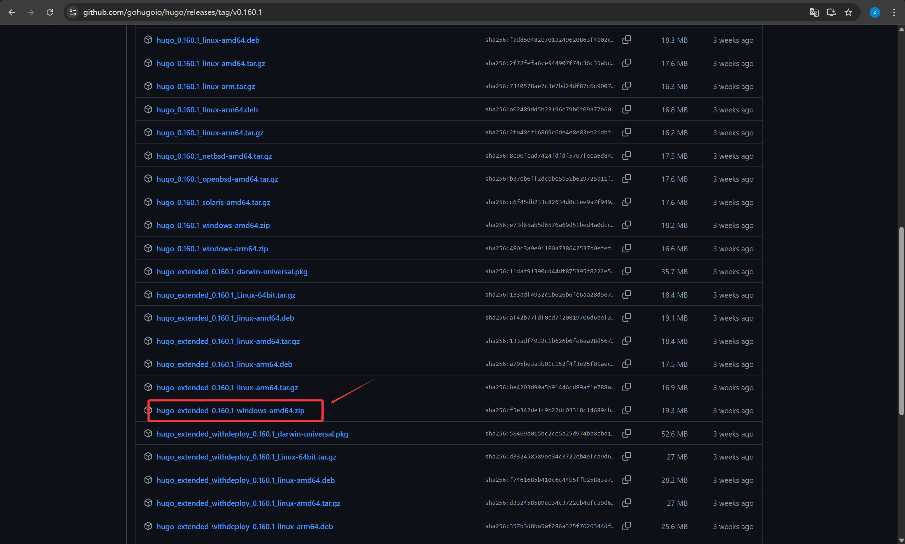

   - 安装[hugo theme](https://themes.gohugo.io/ "hugo主题库")（这里我选用[Stack主题](https://github.com/CaiJimmy/hugo-theme-stack "stack主题源码仓库") ，版本按需选择，这里我选择v3大版本中最新的稳定版本[v3.34.2 ](https://github.com/CaiJimmy/hugo-theme-stack/releases/tag/v3.34.2) ）

    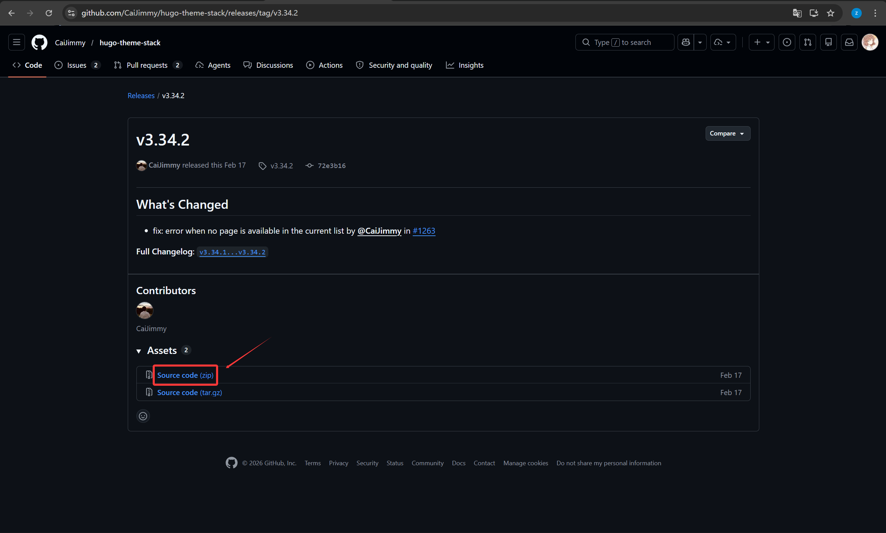

   - 安装[git]([Git](https://git-scm.com/) "Git官网") ，并注册一个[Github](https://github.com/ "Github官网")账号（本教程略）

3. 配置全局环境变量
   - 上面装的 `hugo` 需要配置环境变量才可全局访问（`git` 的安装向导会提示你设置全局，也可以手动设置，操作同 `hugo` ），以`windows` 为例，打开开始菜单搜索`编辑系统环境变量` ，依次点击`环境变量 → Path(用户变量) → 新建 → 填写安装好的hugo文件路径 → 确定*3`

    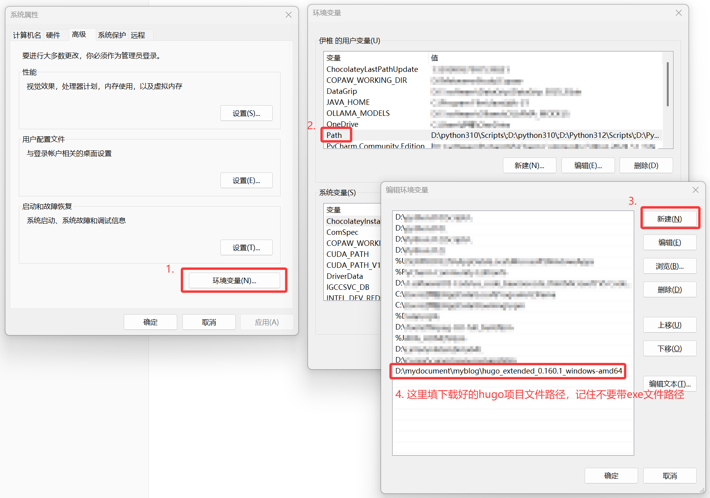

   - `win+r` 用输入命令`cmd`打开命令提示符 ,输入命令 `hugo version` 和`git -v`验证一下是否成功，成功后有版本号输出

    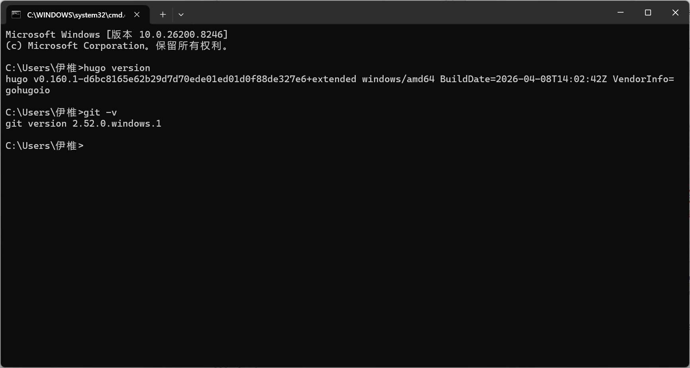

## 搭建流程

下面的操作是我参考b站UP主 [Letere-莱特雷](https://www.bilibili.com/video/BV1bovfeaEtQ?spm_id_from=333.788.videopod.sections&vd_source=b1e2460771cdfeeedfc430c3edea4cd6) 的教程搭建的，当然你也可以按照[官方文档](https://gohugo.io/getting-started/quick-start/)的最新教程来操作

### 创建本地 hugo 博客项目

```powershell
# 1.创建项目框架 dev (在你期望的的路径下操作，我这里路径为"D:\mydocument\myblog"，dev是项目名，可以任取)
hugo new site dev

# 2.进入到dev目录下
cd dev 

# 3.初始化git仓库（方便管理项目版本，同时后面会用git推送到Github仓库里）
git init

# 4.①将安装解压好的主题 Stack 放到 themes/Stack 目录下
# 4.②也可以通过git的子模块安装命令安装 git submodule add https://github.com/CaiJimmy/hugo-theme-stack.git themes/Stack

# 5.在项目配置文件中添加一行，指示当前主题
echo "theme = 'Stack'" >> hugo.toml

# 6.向项目中添加一个新页面（后面创建博客页面也是如此）
hugo new content content/posts/my-first-post.md

# 7.使用编辑器打开文件my-first-post.md，你会看到自动生成的前言，如下图，你可以在前言下方书写你的草稿（Markdown代码），但请不要随意改动引言的内容或删除，否则可能会出现一些问题，如果你想改动，可以去研究一下官方文档 https://gohugo.io/content-management/front-matter/
```

  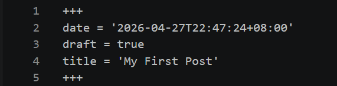

```powershell
# 8.启动 hugo 服务
hugo server -D
```

完成上面的步骤你就已经搭建好你的本地博客站点啦

### Github托管部署

1. 新建一个仓库，命名为 `你的用户名.github.io`（这样我们就可以得到 `github` 给我们提供的一个免费域名 `“https://你的用户名.github.io/”`）

  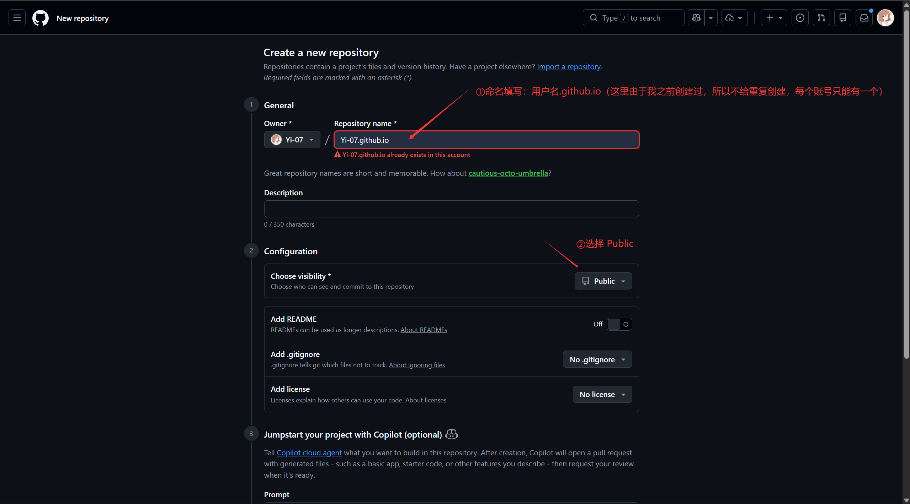

  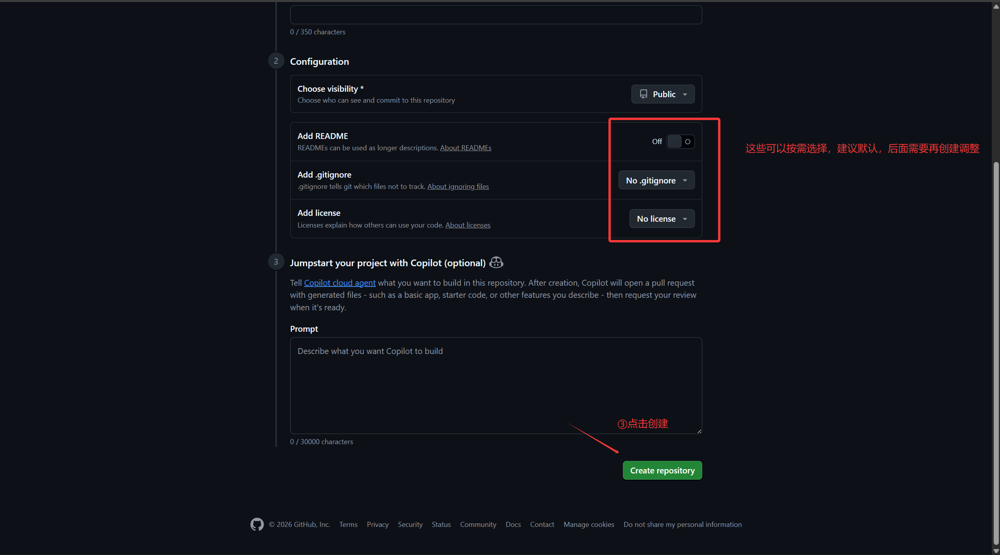

2. 打开刚刚创建好的仓库，点击仓库上方的 `Settings`，再点击 Pages，将 `Build and deployment`下的 `Source` 改为 `Github Actions`（默认为 `Deploy from a branch`）

  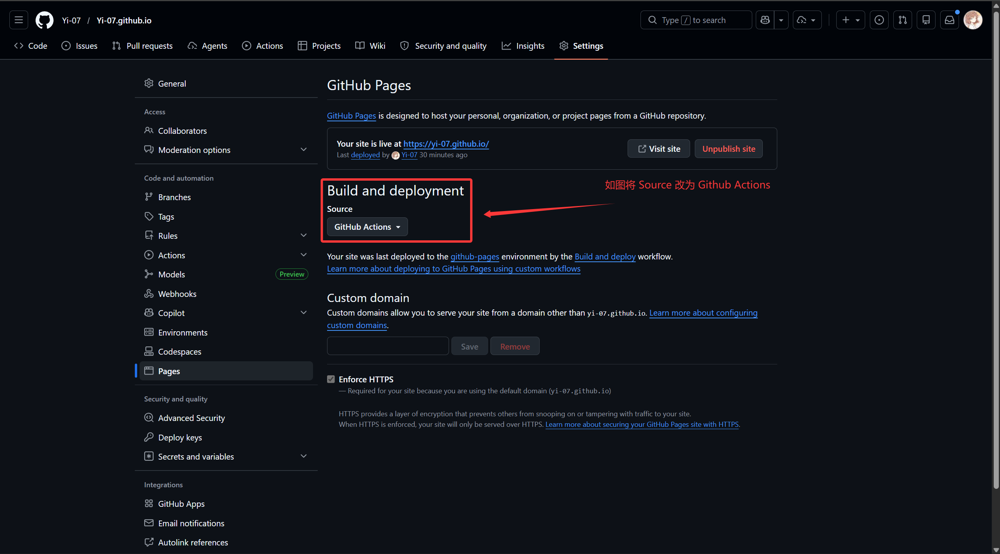

3. 回到之前创建好的本地 `hugo` 博客项目，打开 `hugo.yaml`（你的站点配置文件，在项目根目录 `dev` 下），确认 `baseURL` 是你的 `GitHub Pages` 地址，并添加图片缓存配置

  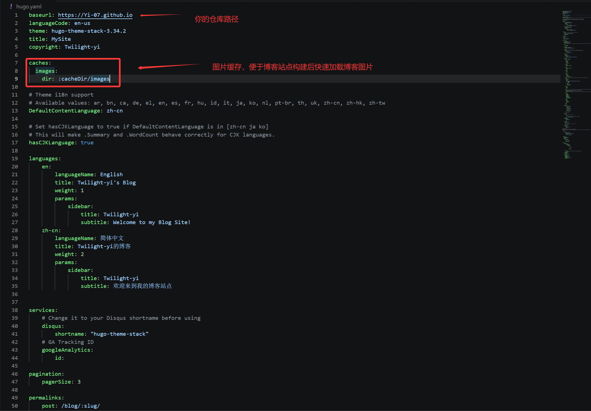

4. 在项目根目录下创建工作流文件

   ```powershell
   mkdir -p .github/workflows
   New-Item .github/workflows/hugo.yaml -ItemType File
   ```

5. 在这个 `hugo.yaml`（是`.github/workflows/hugo.yaml` 不是主配置文件）里粘贴下面的代码

   ```yaml
   name: Build and deploy
   on:
     push:
       branches:
         - main
     workflow_dispatch:
   permissions:
     contents: read
     pages: write
     id-token: write
   concurrency:
     group: pages
     cancel-in-progress: false
   defaults:
     run:
       shell: bash
   jobs:
     build:
       runs-on: ubuntu-latest
       env:
         DART_SASS_VERSION: 1.99.0
         GO_VERSION: 1.26.1
         HUGO_VERSION: 0.160.1
         NODE_VERSION: 24.14.1
         TZ: Asia/Shanghai
       steps:
         - name: Checkout
           uses: actions/checkout@v6
           with:
             submodules: false
             fetch-depth: 0
         - name: Setup Go
           uses: actions/setup-go@v6
           with:
             go-version: ${{ env.GO_VERSION }}
             cache: false
         - name: Setup Node.js
           uses: actions/setup-node@v6
           with:
             node-version: ${{ env.NODE_VERSION }}
         - name: Setup Pages
           id: pages
           uses: actions/configure-pages@v6
         - name: Create directory for user-specific executable files
           run: mkdir -p "${HOME}/.local"
         - name: Install Dart Sass
           run: |
             curl -sLJO "https://github.com/sass/dart-sass/releases/download/${DART_SASS_VERSION}/dart-sass-${DART_SASS_VERSION}-linux-x64.tar.gz"
             tar -C "${HOME}/.local" -xf "dart-sass-${DART_SASS_VERSION}-linux-x64.tar.gz"
             rm "dart-sass-${DART_SASS_VERSION}-linux-x64.tar.gz"
             echo "${HOME}/.local/dart-sass" >> "${GITHUB_PATH}"
         - name: Install Hugo
           run: |
             curl -sLJO "https://github.com/gohugoio/hugo/releases/download/v${HUGO_VERSION}/hugo_extended_${HUGO_VERSION}_linux-amd64.tar.gz"
             mkdir "${HOME}/.local/hugo"
             tar -C "${HOME}/.local/hugo" -xf "hugo_extended_${HUGO_VERSION}_linux-amd64.tar.gz"
             rm "hugo_extended_${HUGO_VERSION}_linux-amd64.tar.gz"
             echo "${HOME}/.local/hugo" >> "${GITHUB_PATH}"
         - name: Install Node.js dependencies
           run: |
             [[ -f package-lock.json || -f npm-shrinkwrap.json ]] && npm ci || true
         - name: Configure Git
           run: git config core.quotepath false
         - name: Cache restore
           id: cache-restore
           uses: actions/cache/restore@v5
           with:
             path: ${{ runner.temp }}/hugo_cache
             key: hugo-${{ github.run_id }}
             restore-keys: hugo-
         - name: Build the site
           run: |
             hugo build \
               --gc \
               --minify \
               --baseURL "${{ steps.pages.outputs.base_url }}/" \
               --cacheDir "${{ runner.temp }}/hugo_cache"
         - name: Cache save
           uses: actions/cache/save@v5
           with:
             path: ${{ runner.temp }}/hugo_cache
             key: ${{ steps.cache-restore.outputs.cache-primary-key }}
         - name: Upload artifact
           uses: actions/upload-pages-artifact@v5
           with:
             path: ./public
     deploy:
       environment:
         name: github-pages
         url: ${{ steps.deployment.outputs.page_url }}
       runs-on: ubuntu-latest
       needs: build
       steps:
         - name: Deploy to GitHub Pages
           id: deployment
           uses: actions/deploy-pages@v5
   ```

  这里有一点要注意一下：如果你前面本地搭建的本地博客项目中的主题是通过的 `git` 的子模块来安装的话（详细看前面2.1的4.②），那么上面的 `yaml` 文件里代码中的 `submodules` 要将 `false → recursive`

  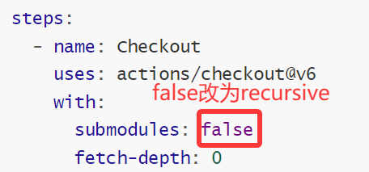

   

6. 在项目根目录创建 `.gitignore` 文件，来避免提交不必要的文件

   ```bash
   # Hugo 构建产物，Github Page部署时会自动构建，不必从本地冗余上传上去
   public/
   resources/
   .hugo_build.lock
   ```

7. 提交并推送项目到远程仓库上

   ```powershell
   # 1. 关联远程仓库（把 URL 换成你自己的）
   git remote add origin https://github.com/你的用户名/你的仓库名.git
   
   # 2. 确认关联成功
   git remote -v
   
   # 3. 添加所有文件并提交
   git add .
   git commit -m "ci: add GitHub Actions workflow and .gitignore"
   
   # 4.推送到Github仓库上
   git push -u origin main # 第一次将本地仓库与远程仓库绑定起来，后面推送直接 git push 就好了
   ```

   等待一会Github Action工作流跑完就可以访问博客站点了

  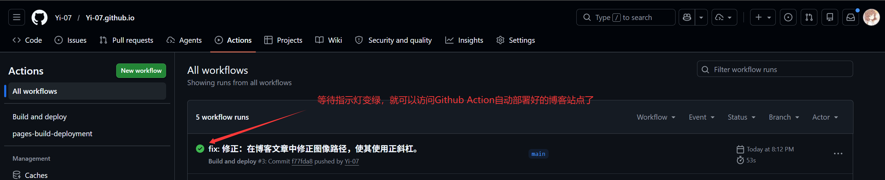

  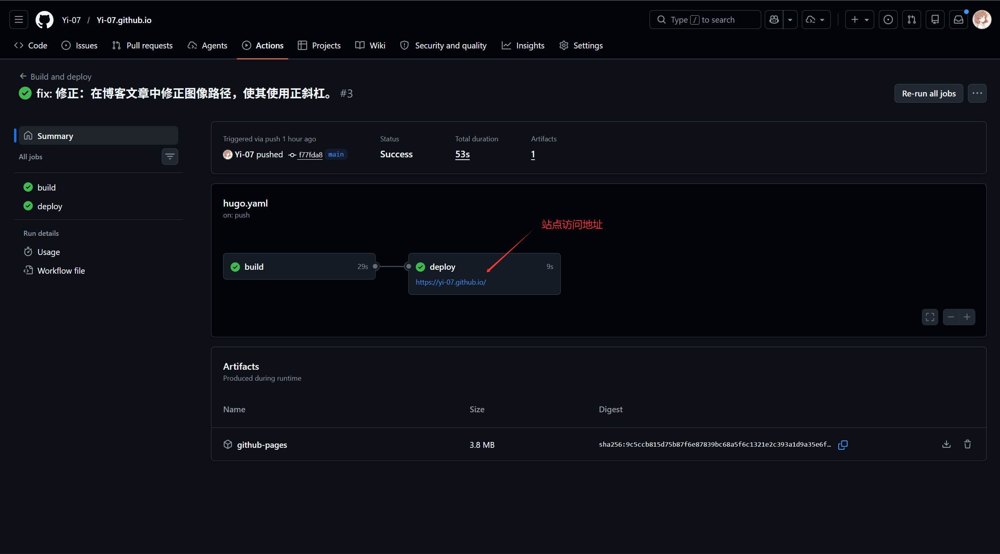
